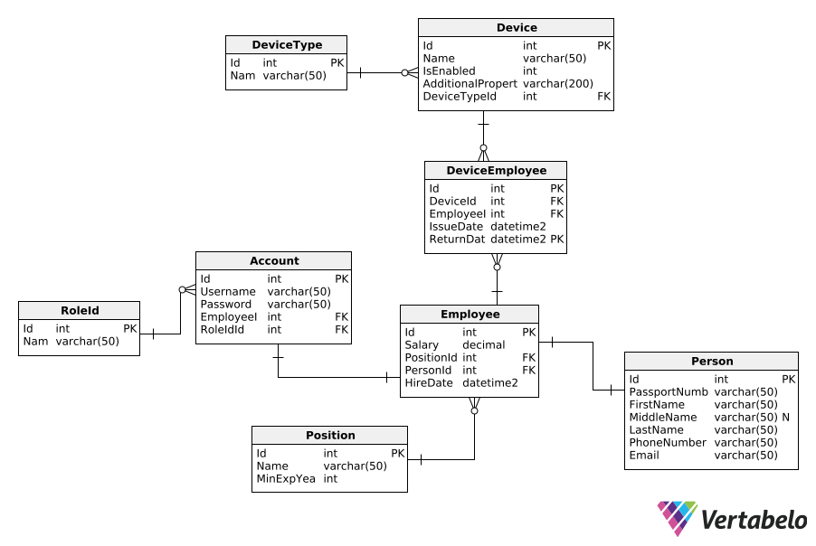

APBD Task 10

To launch your project, you need to add appsettings.json file with these contents:
```
{
  "Logging": {
    "LogLevel": {
      "Default": "Information",
      "Microsoft.AspNetCore": "Warning"
    }
  },
  "AllowedHosts": "*",
  "ConnectionStrings": {
    "EmployeeDatabase": "<your connection string>"
  },
  "Jwt":{
    "Issuer": <who provides tokens>,
    "Audience": <who is provided with tokens>,
    "Key": <hashing key>,
    "ValidInMinutes": <token's lifespan>
  }
}
```

## Splitting the projects
I decided to split the project as usual into 4 parts: Models, Repositories, Services and API (endpoints). The reasons for that are the same as before: Models for model definition, Repositories for repositories (connection to the database), Services for validation and API for endpoints and Dependency Injections.

Correction: removed repository pattern because there's no need for it

## Database Schema


## Technologies and Techniques Used
1. Used **Entity Framework** to implement first database-first and then code-first approach using the corresponding Entity Classes and Database Context.
2. Used **JWT** to implement **Authentication** and **Authorization** by roles.
3. Used **Midlleware** to implement pre-endpoint validation according to the custom ruleset described in the [rules json](validation_rules/validation_rules.json).
4. Used **Password Hashing** to safely hash and save the password in the database.
5. Used **Docker** to launch a server with an MS SQL database. Then connected to it using the connection string.
6. Separated the solution into a couple of projects for better structure.
